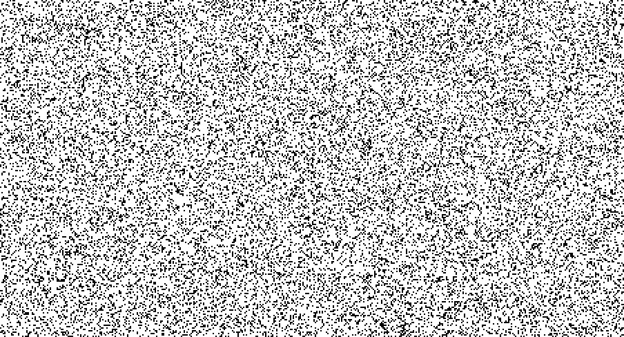

Consider two identical layers of random points and gently move one above the other. See the circles?

The composition of a rotation and a translation is a rotation.

See also [Теорема Шаля](http://images.math.cnrs.fr/Teorema-SHalya).
